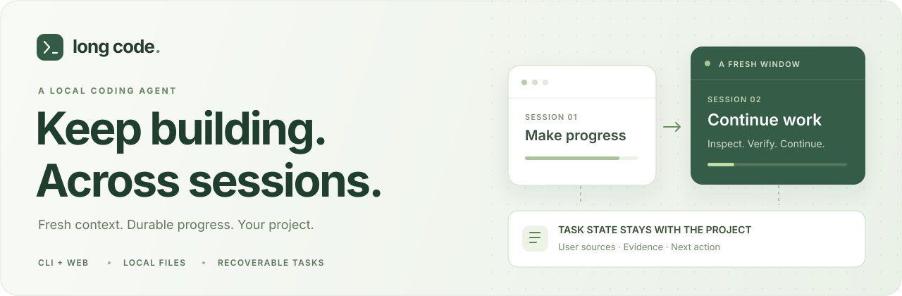
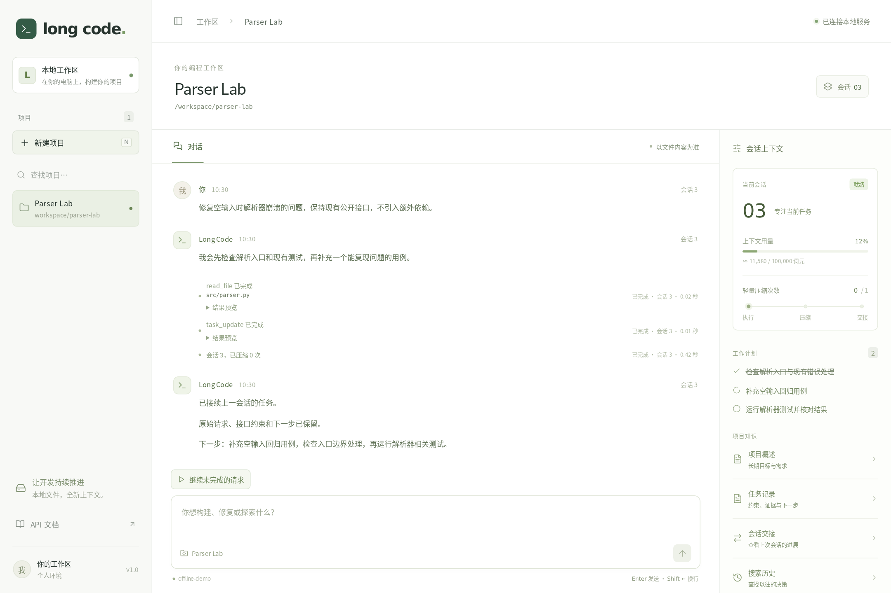
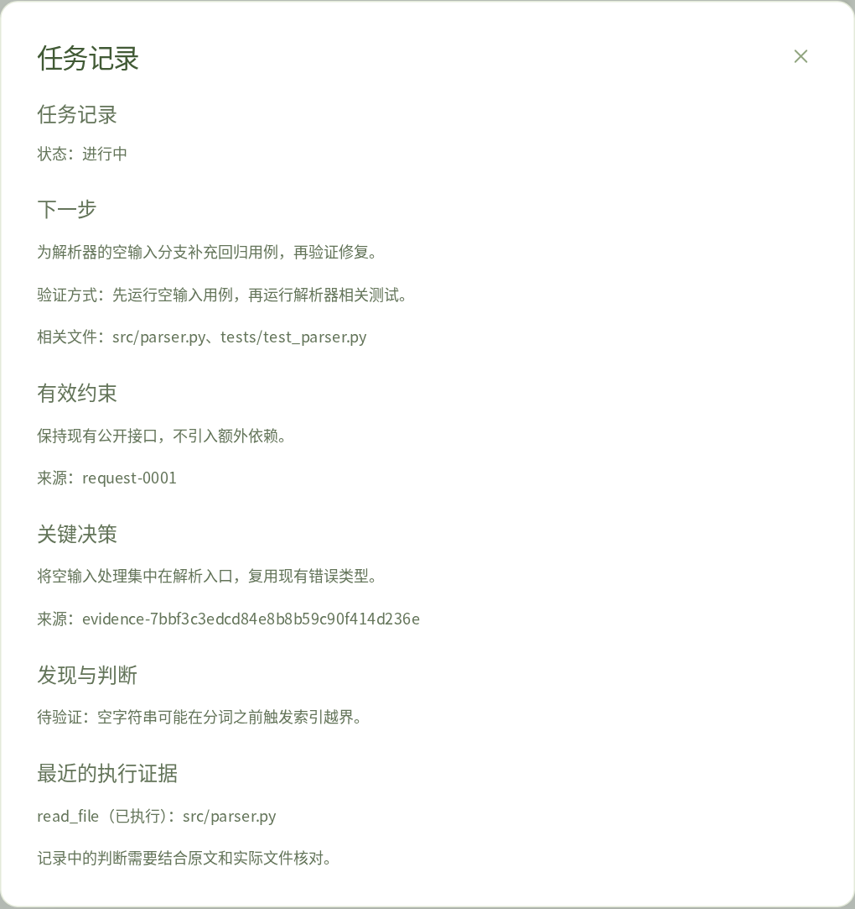
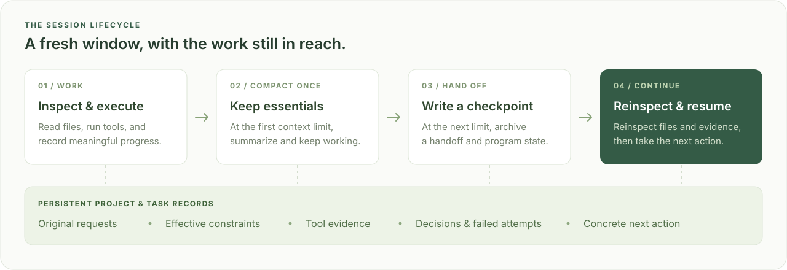

<p align="center">
  
</p>

<p align="center">
  在本地项目中持续推进开发任务的编程智能体。<br>
  <strong>命令行与网页工作区 · 可恢复的会话 · 持久化任务记录</strong>
</p>

<p align="center">
  <a href="https://github.com/lpppprmm/Long-Code/actions/workflows/checks.yml"></a>
  
  
  
</p>

<p align="center">
  <a href="#quick-start">快速开始</a> ·
  <a href="#the-workspace">工作区预览</a> ·
  <a href="#how-it-works">工作原理</a> ·
  <a href="#project-layout">项目结构</a> ·
  <a href="#development">开发与测试</a>
</p>

---

复杂开发任务往往无法在一个上下文窗口内完成。Long Code 在切换会话时保留项目状态、当前任务和下一步行动，让开发能够继续推进。它直接在已有项目目录中工作，通过兼容 Anthropic Messages API 的服务调用模型，并将工作记录保存在本地文件中。

| 持续推进 | 保留任务脉络 | 留存执行依据 |
| :--- | :--- | :--- |
| 先压缩一次上下文，再次达到预算时交接到新会话。 | 保留用户约束、关键决策、失败尝试和明确的下一步。 | 随时查阅原始请求、工具结果、文件指纹和历史会话。 |

<a id="the-workspace"></a>

## 工作区预览

在同一个工作区中与智能体对话、查看工具执行情况，并跟踪上下文用量、待办事项、项目文档和任务记录。



<sub>真实网页界面，使用离线演示数据渲染。生成截图时不会调用模型。</sub>

<details>
<summary><strong>展开查看任务记录</strong></summary>

任务记录集中展示下一步行动、验证条件、有效约束和来源引用。界面读取的正是会话恢复时使用的持久化记录。



</details>

<a id="quick-start"></a>

## 快速开始

**环境要求：** Linux 或 macOS、Python 3.10+、Bash。网页界面还需要 Node.js 20.19+ 或 22.12+。Git 为可选依赖，安装后可支持仓库状态检查。

**1. 安装后端依赖**

```sh
git clone https://github.com/lpppprmm/Long-Code.git long-code
cd long-code
python3 -m venv .venv
.venv/bin/python -m pip install -r requirements.txt
[ -f .env ] || cp .env.example .env
```

**2. 配置模型**

编辑项目根目录的 `.env` 文件，填写 API 密钥和模型名称：

```dotenv
ANTHROPIC_API_KEY=your-api-key
MODEL_ID=your-model-id

# 可选：使用兼容 Anthropic Messages API 的服务
# ANTHROPIC_BASE_URL=https://your-compatible-api.example
```

项目管理和离线测试无需模型凭据；对话功能需要配置模型和 API 密钥。已导出的环境变量优先于 `.env` 中的设置。

**3. 启动网页工作区**

```sh
npm --prefix frontend ci
```

在项目根目录打开**两个终端**，分别运行：

| 终端 1 · 后端 | 终端 2 · 前端 |
| :--- | :--- |
| `.venv/bin/python -m uvicorn long_code.api:app --host 127.0.0.1 --port 8000` | `npm --prefix frontend run dev` |

打开 **[localhost:5173](http://127.0.0.1:5173)**，添加一个已存在的项目目录即可开始使用。API 文档位于 [localhost:8000/docs](http://127.0.0.1:8000/docs)。

<details>
<summary><strong>使用命令行界面</strong></summary>

在项目根目录运行：

```sh
.venv/bin/python -m long_code
```

```text
> new demo ~/code/existing-project
demo [1] > 找到失败的解析器测试并修复问题。
demo [1] > /current
demo [1] > /back
> list
> open demo
demo [1] > /continue
```

任务尚未完成时，可用 `/continue` 继续执行。输入 `/help` 查看命令，输入 `/exit` 退出。名称或路径包含空格时需要加引号，项目目录必须已经存在。

[完整命令说明（英文）→](docs/reference.md#cli-commands)

</details>

> **本地运行说明：** 后端仅运行一个工作进程，并绑定到本机回环地址。后端没有登录认证，Shell 命令以当前用户权限执行，不具备安全沙箱隔离能力。

<a id="projects-sessions-and-recovery"></a>
<a id="how-it-works"></a>

## 工作原理

每个会话都有明确的上下文预算。首次达到阈值时，Long Code 压缩对话，并保留最近完整的工具调用与结果；再次达到阈值时，写入交接文档和检查点，然后开启新会话。



新会话会先检查项目文件并核对记录，再继续执行。任务记录直接从磁盘加载，即使对话摘要遗漏了细节，已记录的约束和下一步行动仍然可用。

| 记录 | 保存内容 |
| :--- | :--- |
| `PROJECT.md` | 项目的长期目标、需求与规则。 |
| `tasks/<id>/task.json` | 当前约束、决策、发现、失败尝试和下一步行动。 |
| `request-*.json` · `evidence-*.json` | 带来源编号的原始用户消息和工具执行结果。 |
| `HANDOFF.md` · `checkpoints/` | 上一会话的交接文档、任务快照与仓库状态。 |
| `transcripts/` | 按需检索的历史消息和事件。 |

记录默认保存在 `~/.simple-agent/projects/<project-id>/`。未完成的请求在中断恢复和会话切换后继续使用同一份任务记录；请求完成后，新请求会创建新记录，旧记录仍保留在磁盘中。

**记录仍需核实。** 标为 `active` 的条目表示仍然有效，并不代表结论已经验证。文件哈希一致或命令成功退出，也不能单独证明功能正确。新会话会收到明确指令，要求在采用旧结论前重新核对相关证据。

[存储结构与恢复机制（英文）→](docs/reference.md#projects-sessions-and-recovery)

<a id="stop-resume-inspect"></a>

## 停止、恢复与查看记录

| 操作 | 网页工作区 | 命令行 |
| :--- | :--- | :--- |
| 停止当前执行 | **停止任务** | `Ctrl-C` |
| 继续未完成的工作 | **继续未完成的请求** | `/continue` |
| 查看下一步与执行依据 | **任务记录** | 请智能体读取任务记录 |
| 查看历史会话 | 点击会话编号 | 请智能体搜索项目历史 |
| 切换项目 | 空闲时选择项目 | `/back`，然后 `open <id>` |

网页端发出停止请求后，正在进行的模型调用会先结束，再响应取消。关闭浏览器不会取消已经接受的任务，重新打开后会连接到当前工作区。中断后再次执行前，应检查已有改动，确认操作是否已部分完成。

<a id="configuration"></a>

## 常用配置

以下配置位于根目录的 `.env` 文件中：

| 配置项 | 默认值 | 作用 |
| :--- | :--- | :--- |
| `CONTEXT_LIMIT_TOKENS` | `100000` | 触发上下文压缩或会话交接的估算 token 预算。 |
| `MAX_TOKENS` | `8000` | 编程模型单次回复的输出预算。 |
| `SUMMARY_MAX_TOKENS` | `4000` | 生成摘要和交接文档时，每次尝试的最大输出预算。 |
| `SIMPLE_AGENT_HOME` | `~/.simple-agent` | 项目记录和历史数据的存储位置。 |

修改后需重启命令行程序或后端服务。若使用其他 API 地址，在 `frontend/.env.local` 中设置 `VITE_API_URL`，并在后端配置对应的 `FRONTEND_ORIGINS`。

[全部配置与工具限制（英文）→](docs/reference.md#configuration)

<a id="development"></a>

## 开发与测试

```sh
# Python 测试与代码检查
.venv/bin/python -m pip install -r requirements-dev.txt
.venv/bin/python -m unittest discover -s tests -v
.venv/bin/python -m ruff check .

# 前端构建与浏览器测试
npm --prefix frontend ci
npm --prefix frontend run build
cd frontend
npx playwright install chromium
npm test
npm run test:integration
```

测试使用确定性的离线响应，不会产生付费模型调用。覆盖内容包括中断恢复、摘要故意遗漏细节时的连续五次交接，以及真实 FastAPI 后端与浏览器协同完成的两次会话切换。

<a id="project-layout"></a>

## 项目结构

```text
long-code/
├── long_code/             # Python 后端与命令行入口
│   ├── __main__.py        # python -m long_code
│   ├── cli.py             # 终端命令解析
│   ├── api.py             # FastAPI 路由与网页工作区
│   ├── application.py     # 共用的项目选择与运行状态管理
│   ├── agent.py           # 模型循环与工具调度
│   ├── session.py         # 上下文压缩、交接与恢复
│   ├── task_state.py      # 持久化任务记录与证据
│   ├── tools.py           # Shell、文件、待办与任务更新工具
│   ├── projects.py        # 项目注册与数据目录锁
│   ├── models.py          # 项目与会话的数据结构
│   ├── history.py         # 历史记录、检索与会话时间线
│   ├── repository.py      # Git 检查与检查点比对
│   ├── storage.py         # 原子写入与限量文件读取
│   └── config.py          # 共用配置与根目录 .env 加载
├── frontend/
│   ├── src/               # 网页应用与样式
│   ├── tests/             # Playwright 界面与集成测试
│   └── scripts/           # README 截图生成工具
├── tests/
│   ├── test_*.py          # Python 离线回归测试
│   └── support/           # 浏览器集成测试使用的离线后端
└── docs/
    ├── architecture.md    # 当前模块边界与开发指南
    ├── reference.md       # 命令、配置与恢复机制
    ├── design-v1.md       # 原始 V1 设计，保留供参考
    └── images/            # README 配图与界面截图
```

[模块边界与启动入口（英文）→](docs/architecture.md)

---

延伸文档（英文）：[架构说明](docs/architecture.md) ·
[原始设计](docs/design-v1.md) ·
[操作参考](docs/reference.md) ·
[图片来源与生成方式](docs/images/README.md)
